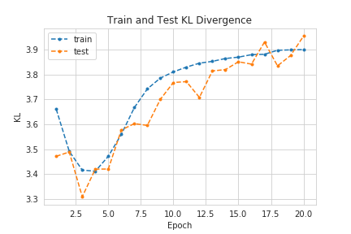
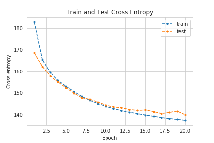
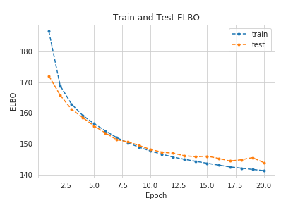
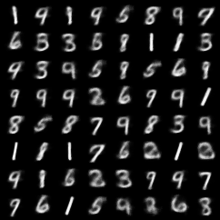

# Variational Auto-Encoders

---

## Introduction

---

Auto-encoders are a well known class of machine learning methods that take some $$N$$-dimensional input, $$\mathbf{x}$$, and attempt to learn the parameters, $$\lambda$$, of a function $$f_{\phi}(\mathbf{x}) : \mathbb{R}^N \rightarrow \mathbb{R}^D$$, with $$D < N$$. This function $$f_{\phi}$$ is called the encoder and the $$D$$-dimensional space is called the latent space. In their simplest (and most optimistic) form, auto-encoders learn a one-to-one mapping of the inputs, $$\mathbf{x}$$ onto the latent space $$\mathbf{z}$$. After encoding the inputs, the latent code $$\mathbf{z}$$ is then fed into another function $$g_{\theta}(\mathbf{z}) : \mathbb{R}^D \rightarrow \mathbb{R}^N$$, called decoder. This function attempts to reverse the encoding and to reproduce the input. Variational auto-encoders (henceforth referred to as VAEs) do not assume a deterministic mapping. In this setting, the latent codes are assumed to have some distribution and the encoder outputs the parameters of said distribution. Afterwards, a code $$\mathbf{z}$$ is produced using the *reparametrization trick* and fed onto the decoder. However, the optimization scheme, namely the loss function, is not the same as in the vanilla auto-encoder. The VAE makes use of the Evidence Lower Bound (ELBO) which is derived [here](./elbo_derivation.html).

## Optimization Scheme for Variational Inference

---

The simplest optimization schemes that can be thought of are gradient-based methods, which require the computation of the gradient with respect to the learnable parameters, in this case, there are two gradients to consider: the one with respect to the variational parameters, $$\phi$$, and the one with respect to $$\theta$$. The latter causes no trouble whatsoever:

$$\nabla_{\theta}\left[ ELBO(\phi, \theta) \right] = - \nabla_{\theta} \left[ \mathbb{E}_{q_{\phi}(\mathbf{z}\mid\mathbf{x})}\left[ \log p_{\theta}(\mathbf{x}\mid\mathbf{z}) \right] \right] = - \mathbb{E}_{q_{\phi}(\mathbf{z}\mid\mathbf{x})}\left[ \nabla_{\theta} \log p_{\theta}(\mathbf{x}\mid\mathbf{z}) \right] $$

Where the last step is possible due to the linearity of the expectation and gradient operators. However, for the gradient with respect to $\phi$ the result is not as straightforward:

$$\nabla_{\phi}[ELBO(\phi, \theta)] = $$

$$=\nabla_{\phi}[\mathbb{E}_{q_{\phi}(\mathbf{z}\mid\mathbf{x})}[\log q_{\phi}(\mathbf{z}\mid\mathbf{x})]] -\nabla_{\phi}[ \mathbb{E}_{q_{\phi}(\mathbf{z}\mid\mathbf{x})} [\log p_{\theta}(\mathbf{x}, \mathbf{z})]] =$$ 

$$ =  \nabla_{\phi} \sum_{\mathbf{z}} q_{\phi}(\mathbf{z}\mid\mathbf{x}) \log q_{\phi}(\mathbf{z}\mid\mathbf{x}) - \nabla_{\phi} \sum_{\mathbf{z}} q_{\phi}(\mathbf{z}\mid\mathbf{x}) \log p_{\theta}(\mathbf{x}, \mathbf{z})= $$

$$ = \sum_{\mathbf{z}} \left[\log q_{\phi}(\mathbf{z}\mid\mathbf{x}) \nabla_{\phi}q_{\phi}(\mathbf{z}\mid\mathbf{x}) + q_{\phi}(\mathbf{z}\mid\mathbf{x}) \frac{\nabla q_{\phi}(\mathbf{z}\mid\mathbf{x})}{q_{\phi}(\mathbf{z}\mid\mathbf{x})}  \right] -$$

$$ - \sum_{\mathbf{z}} \left[  \log p_{\theta}(\mathbf{x},\mathbf{z}) \nabla_{\phi} q_{\phi}(\mathbf{z}\mid\mathbf{x})   \right]= $$

$$ = \sum_{\mathbf{z}} \left[ \nabla_{\phi}(q_{\phi}(\mathbf{z}\mid\mathbf{x}))  (\log q_{\phi}(\mathbf{z}\mid\mathbf{x}) + 1)   \right] - $$

$$ - \sum_{\mathbf{z}} \left[  \log p_{\theta}(\mathbf{x},\mathbf{z}) \nabla_{\phi} q_{\phi}(\mathbf{z}\mid\mathbf{x})   \right] =$$ 

$$ = \sum_{\mathbf{z}} \left[ \log q_{\phi}(\mathbf{z}\mid\mathbf{x}) - \log p_{\theta}(\mathbf{x}, \mathbf{z}) \right] \nabla_{\phi} q_{\phi}(\mathbf{z}\mid\mathbf{x}) =$$

$$= \mathbb{E}_{q_{\phi}(\mathbf{z}\mid\mathbf{x})} \left[\left[ \log q_{\phi}(\mathbf{z}\mid\mathbf{x}) - \log p_{\theta}(\mathbf{x}, \mathbf{z}) \right] \nabla_{\phi} \log q_{\phi}(\mathbf{z}\mid\mathbf{x})\right]$$

The main issue with this result is that estimators based on this equation yield high variance which is, obviously, undesirable. A way to efficiently compute these derivatives is to rely on what is called the *reparametrization trick*, where samples, $$\epsilon$$, from a simple distribution are drawn and then adequately transformed into samples of $$\mathbf{z}\mid\mathbf{x}$$ (the base distribution and the transformation, $$f$$, is dependent of the assumptions for the prior and posterior distributions). This means that $$\mathbf{z}\mid\mathbf{x}$$ is a function of $$\epsilon$$ and thus, due to the Law of the Unconscious Statistician (or directly derived from the properties of the Lebesgue-Stieltjes integral, with which expectations are formally defined), and thus expectations with respect to $$q_{\phi}(\mathbf{z}\mid\mathbf{x})$$ can be written as expectations with respect to the distribution of $$\epsilon$$, $$p(\epsilon)$$, and easily approximated by Monte Carlo:

$$\mathbb{E}_{q_{\phi}(\mathbf{z}\mid\mathbf{x})}[h(\mathbf{z})] = \mathbb{E}_{p(\epsilon)}[h(f(\epsilon))] \approx \frac{1}{L} \sum_{l=1}^L h(f(\epsilon_l))$$

Where $$h(\cdot)$$ is some function of $$\mathbf{z}$$. In this setting, the distributional parameters of $$q_{\phi}(\mathbf{z}\mid\mathbf{x})$$ are estimated with what is called an inference network and the reconstruction is produced from samples of said distribution with a recognition network. The use of these structures and Monte Carlo estimators is sometimes referred to as *amortized variational inference*.

## Gaussian Variational Auto-Encoders for Binary Data

---

Let us now explore the simplest formulation of a VAE. Suppose we have some $$N$$-dimensional binary observations, $$\mathbf{x}$$, and choose the dimension of the latent space to be $$D$$, *i.e.*, $$\mathbf{z} \in \mathbb{R}^D$$. As for the prior distribution, $$p(\mathbf{z})$$, it is taken to be Gaussian with zero mean and covariance given by the identity matrix and the posterior distribution is similarly Gaussian but with mean $$\mu \in \mathbb{R^D}$$ and diagonal covariance structure given by $$\sigma^2 I$$, where $$\sigma^2 \in \mathbb{R}^D$$. Note that, in this case, the reparametrization trick is straightforward: we need only to sample $$\epsilon$$ from $$\mathcal{N}(0, I)$$ and $$\mathbf{z}$$ is calculated through $$\mathbf{z} = \mu + \epsilon \odot \sigma^2$$ (where $$\odot$$ is the Hadamard or element-wise product).

We can model our inference network, $$ \log q_{\phi}(\mathbf{z}\mid\mathbf{x}) = \log \mathcal{N}(\mathbf{x}; \mu, \sigma^2 I)$$ using a simple Multi-Layer Perceptron (MLP):
* $$\mathbf{h} = \tanh (\mathbf{W}_1 \mathbf{x} + \mathbf{b}_1)$$;
* $$\mu = \mathbf{W}_2 \mathbf{h} + \mathbf{b}_2$$;
* $$\log \sigma^2 = \mathbf{W}_3 \mathbf{h} + \mathbf{b}_3$$,

where $h$ has dimension $K$ which is smaller than the input's dimension but larger than the latent space's dimension, and $$\{\mathbf{W}_1, \mathbf{W}_2, \mathbf{W}_3,\mathbf{b}_1, \mathbf{b}_2, \mathbf{b}_3 \}$$ are the weights and biases of the MLP.

The other part of the VAE is the recognition network, the probabilistic decoder, which takes in an element of the latent space and attempts to construct an output that resembles the input. Similarly to before, this is also given by an MLP:
* $$\mathbf{h'} = \tanh(\mathbf{W}_4 \mathbf{z} + \mathbf{b}_4)$$;
* $$\mathbf{\tilde{x}} = \sigma (\mathbf{W}_5 \mathbf{h'} + \mathbf{b}_5)$$,

where $$\sigma(x) = 1 / (1 + \exp(-x))$$ is the sigmoid function applied in an element-wise fashion.

Now, to build the VAE, we require only to put these two modules together and include the aforementioned reparametrization trick, as the figure below describes.

```html
<p align="center">
  
</p>
```

## The Data

---

The data used in this example is the MNIST handwritten digit dataset, comprised of 60,000 training examples of 28x28 images and 10,000 test examples. The data isn't binary but it is possible to make it so: simply by devising a threshold above which the pixel data is turned into ones and turned into zeros if below said threshold.

Since the data type is fixed, the ELBO loss can now be put onto a more explicit form. The $$\mathbb{E}_{q_{\phi}(\mathbf{z}\mid\mathbf{x})} \left[ \log p_{\theta}(\mathbf{x}\mid\mathbf{z}) \right]$$ is simply a reconstruction loss, so it makes sense to use the cross-entropy loss function, which is simply given by:

$$L_{\text{reconstruction}}(\mathbf{x}, \mathbf{\tilde{x}}) = - \sum_{i=1}^N x_i \log(1 - \tilde{x}_i) + (1 - x_i)\log(1 - \tilde{x}_i)$$

However, the Kullback-Leibler divergence term requires a bit more of mathematical gymnastics to derive. Fortunately, I have already derived it [here](./kl_divergence_gaussians.html):

$$\mathcal{D}\left[ q_{\phi}(\vec z \mid \vec x) \parallel  p(\vec z)\right] = \frac{1}{2} \sum_{i=1}^D \left[ \mu_i^2 + \sigma_i^2 - \log \sigma_i^2 - 1 \right]$$

## Tracking the Training Process

---







## VAEs are Generative Models!

---

There are two cool things about VAEs: the first is that, for new observations, we can estimate the likelihood of said observation belonging to our model, which can be used to devised anomaly detection routines. The second is that we can generate new samples by simply unplugging the encoder and feeding unit Gaussian noise directly onto the decoder! Below are some randomly generated samples:



### References

---

* Diederik P. Kingma and Max Welling, *Auto-Encoding Variational Bayes*, (2014), arXiv:1312.6114v10
* Carl Doersch, *Tutorial on Variational Autoencoders*, (2016), arXiv:1606.05908v2